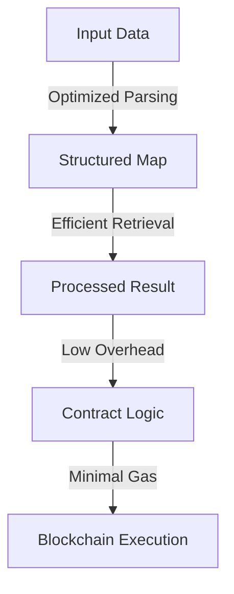
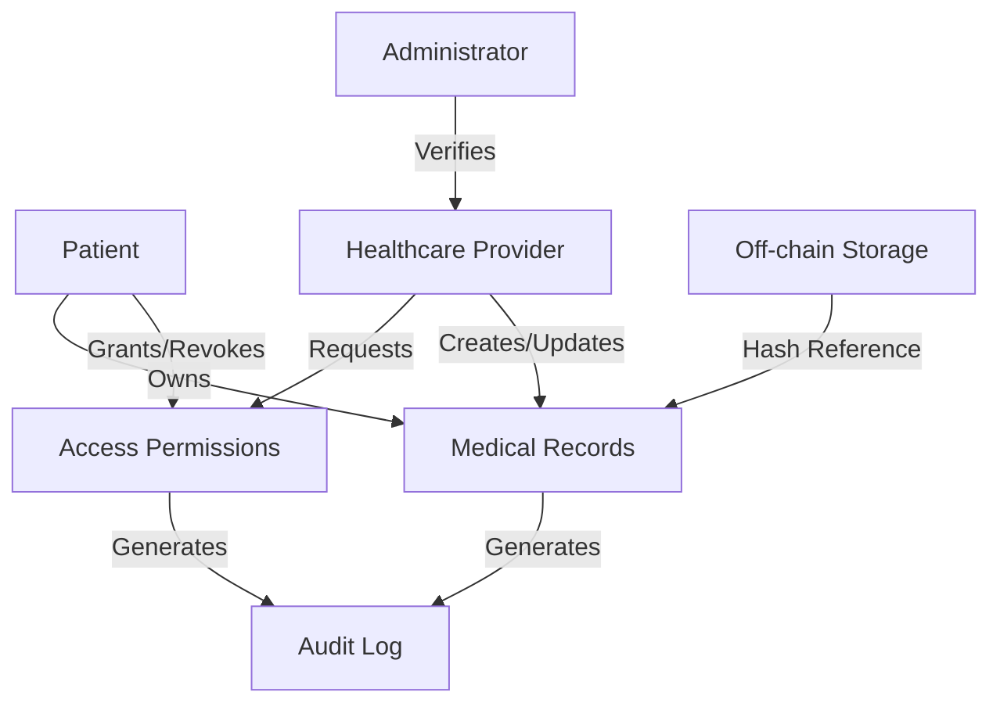

# # Stable Deserialize Optimizer

A high-performance Clarity smart contract library for efficient data deserialization and access optimization on the Stacks blockchain.

## Overview

Stable Deserialize Optimizer is an advanced utility library designed to enhance data retrieval and processing efficiency in Stacks smart contracts. By implementing intelligent deserialization techniques and optimized data access patterns, this library helps developers minimize computational overhead and improve contract performance.

### Key Features

- Efficient data deserialization strategies
- Reduced memory and computational complexity
- Flexible mapping and retrieval mechanisms
- Minimal gas consumption during data access
- Statically typed data structures
- Comprehensive error handling

## Architecture

The library provides a set of optimized functions and data structures that enable faster, more reliable data management within Clarity smart contracts. The core design focuses on reducing complexity and improving runtime performance.



### Core Components

1. **Deserialization Engine**
    - Fast data parsing
    - Type-safe transformations
    - Predictable memory allocation

2. **Access Optimization**
    - Cached map lookups
    - Minimized computational steps
    - Reduced blockchain state interactions

3. **Error Management**
    - Precise error codes
    - Comprehensive validation
    - Fail-fast mechanisms

## Contract Documentation

### Data Access Optimizer Contract

The primary contract (`data-access-optimizer.clar`) provides core optimization utilities:

#### Key Capabilities

- Efficient map-based data retrieval
- Intelligent deserialization helpers
- Performance-focused data structures
- Robust error handling mechanisms

## Getting Started

### Prerequisites

- Clarinet CLI
- Stacks development environment
- Understanding of Clarity smart contract development

### Installation

1. Clone the repository
```bash
git clone <repository-url>
cd stable-deserialize-optimizer
```

2. Install dependencies
```bash
clarinet install
```

3. Run tests
```bash
clarinet test
```

## Development

### Testing Strategy

The library includes comprehensive test scenarios covering:
- Deserialization performance
- Error handling
- Edge case management
- Computational efficiency validation

### Local Development

1. Start Clarinet console:
```bash
clarinet console
```

2. Deploy contract:
```bash
clarinet deploy
```

## Performance Considerations

- Minimizes unnecessary data transformations
- Reduces blockchain state read/write operations
- Provides predictable computational complexity
- Designed for gas efficiency

## Known Optimizations

- Constant-time map lookups
- Reduced memory allocations
- Compile-time type checking
- Efficient error propagation

A blockchain-based platform enabling patient sovereignty over medical records with secure, permissioned sharing capabilities on the Stacks blockchain.

## Overview

# Stable Deserialize Optimizer

A high-performance Clarity smart contract library for efficient data deserialization and access optimization on the Stacks blockchain.

## Overview

Stable Deserialize Optimizer is an advanced utility library designed to enhance data retrieval and processing efficiency in Stacks smart contracts. By implementing intelligent deserialization techniques and optimized data access patterns, this library helps developers minimize computational overhead and improve contract performance.

### Key Features

- Efficient data deserialization strategies
- Reduced memory and computational complexity
- Flexible mapping and retrieval mechanisms
- Minimal gas consumption during data access
- Statically typed data structures
- Comprehensive error handling

## Architecture

The library provides a set of optimized functions and data structures that enable faster, more reliable data management within Clarity smart contracts. The core design focuses on reducing complexity and improving runtime performance.


### Core Components

1. **Deserialization Engine**
    - Fast data parsing
    - Type-safe transformations
    - Predictable memory allocation

2. **Access Optimization**
    - Cached map lookups
    - Minimized computational steps
    - Reduced blockchain state interactions

3. **Error Management**
    - Precise error codes
    - Comprehensive validation
    - Fail-fast mechanisms

## Contract Documentation

### Data Access Optimizer Contract

The primary contract (`data-access-optimizer.clar`) provides core optimization utilities:

#### Key Capabilities

- Efficient map-based data retrieval
- Intelligent deserialization helpers
- Performance-focused data structures
- Robust error handling mechanisms

## Getting Started

### Prerequisites

- Clarinet CLI
- Stacks development environment
- Understanding of Clarity smart contract development

### Installation

1. Clone the repository
```bash
git clone <repository-url>
cd stable-deserialize-optimizer
```

2. Install dependencies
```bash
clarinet install
```

3. Run tests
```bash
clarinet test
```

## Development

### Testing Strategy

The library includes comprehensive test scenarios covering:
- Deserialization performance
- Error handling
- Edge case management
- Computational efficiency validation

### Local Development

1. Start Clarinet console:
```bash
clarinet console
```

2. Deploy contract:
```bash
clarinet deploy
```

## Performance Considerations

- Minimizes unnecessary data transformations
- Reduces blockchain state read/write operations
- Provides predictable computational complexity
- Designed for gas efficiency

## Known Optimizations

- Constant-time map lookups
- Reduced memory allocations
- Compile-time type checking
- Efficient error propagation is a decentralized healthcare records management system that puts patients in control of their medical data while enabling secure collaboration with healthcare providers. The platform combines the immutability and security of blockchain technology with a sophisticated permissions system to create a trustless environment for managing sensitive health information.

### Key Features

- Patient-controlled access management
- Verified healthcare provider registry
- Immutable audit trail of all record interactions
- Flexible permission settings with time-based access control
- Secure record storage with off-chain data encryption
- Comprehensive activity logging

## Architecture

The system is built around a core smart contract that manages users, records, permissions, and audit logging. The architecture follows a role-based access control model with three primary actors: patients, healthcare providers, and administrators.



### Core Components

1. **User Management**
   - Patient registration
   - Provider registration and verification
   - Account status tracking

2. **Records Management**
   - Medical record creation
   - Record updates
   - Record access control

3. **Permissions System**
   - Granular access control
   - Time-based permissions
   - Record-specific permissions

4. **Audit System**
   - Comprehensive activity logging
   - Access tracking
   - Modification history

## Contract Documentation

### Medical Records Contract

The primary contract (`medical-records.clar`) handles all core functionality:

#### Key Functions

**Patient Operations**
- `register-patient`: Register new patient account
- `grant-access`: Grant provider access to records
- `revoke-access`: Revoke provider access

**Provider Operations**
- `register-provider`: Register new healthcare provider
- `add-medical-record`: Create new medical record
- `update-medical-record`: Update existing record

**Administrative Operations**
- `verify-provider`: Verify healthcare provider credentials
- `set-admin`: Change contract administrator
- `deactivate-account`: Deactivate user account
- `reactivate-account`: Reactivate user account

## Getting Started

### Prerequisites

- Clarinet CLI installed
- Stacks wallet for deployment
- Node.js for testing environment

### Installation

1. Clone the repository
```bash
git clone <repository-url>
cd health-records-sovereign-chain
```

2. Install dependencies
```bash
clarinet install
```

3. Run tests
```bash
clarinet test
```

## Function Reference

### Patient Functions

```clarity
(register-patient (name (string-utf8 64)))
```
Registers a new patient in the system.

```clarity
(grant-access (provider principal) (access-level uint) (expires-in uint) (specific-records (list 20 uint)))
```
Grants record access to a healthcare provider.

### Provider Functions

```clarity
(add-medical-record (patient principal) (title (string-utf8 100)) (record-type (string-utf8 50)) (data-hash (buff 32)) (description (string-utf8 200)))
```
Creates a new medical record for a patient.

```clarity
(update-medical-record (patient principal) (record-id uint) (title (string-utf8 100)) (data-hash (buff 32)) (description (string-utf8 200)))
```
Updates an existing medical record.

## Development

### Testing

The contract includes comprehensive test scenarios:

1. User registration flows
2. Permission management
3. Record creation and updates
4. Access control verification
5. Audit logging validation

### Local Development

1. Start Clarinet console:
```bash
clarinet console
```

2. Deploy contract:
```bash
clarinet deploy
```

## Security Considerations

### Access Control
- All record access requires explicit permission
- Permissions can be time-limited
- Providers must be verified before accessing records

### Data Privacy
- Only record hashes are stored on-chain
- Sensitive data should be encrypted off-chain
- Access revocation is immediate and permanent

### Known Limitations
- Maximum 20 specific records per permission grant
- Provider verification cannot be automated
- No built-in data encryption